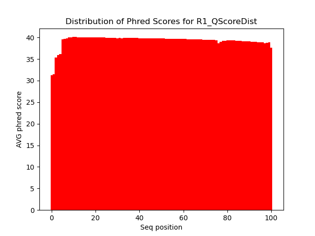
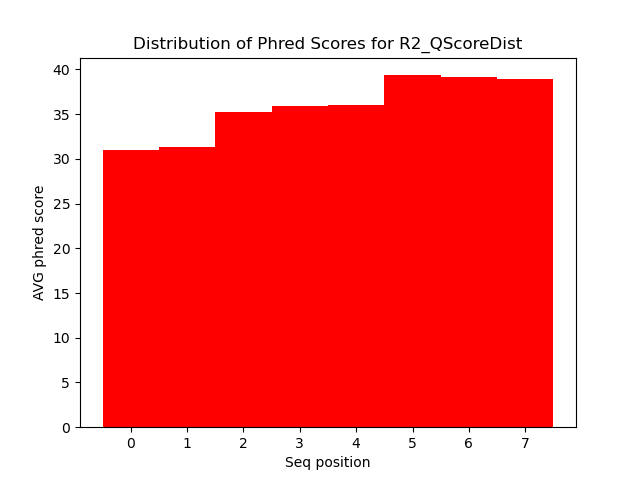
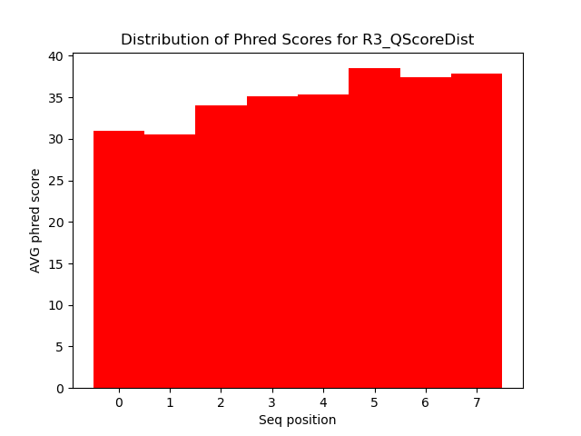
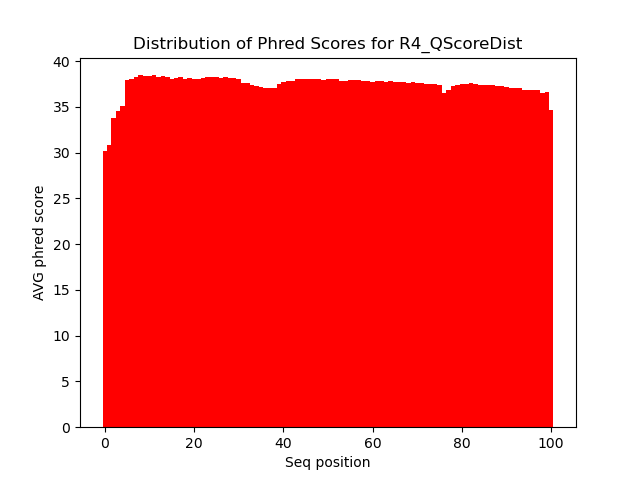

# Assignment the First

## Part 1
1. Be sure to upload your Python script. Provide a link to it here: [fastq_qscore_distribution.py](../fastq_qscore_distribution.py)

| File name | label | Read length | Phred encoding |
|---|---|---|---|
| 1294_S1_L008_R1_001.fastq.gz | R1 | 101 | Phred+33 |
| 1294_S1_L008_R2_001.fastq.gz | R2 |  8  | Phred+33 |
| 1294_S1_L008_R3_001.fastq.gz | R3 |  8  | Phred+33 |
| 1294_S1_L008_R4_001.fastq.gz | R4 | 101 | Phred+33 |

2. Per-base NT distribution
    1. Use markdown to insert your 4 histograms here.
    2. 
    3. 
    4. 
    5. 

3. Questions

    What is a good quality score cutoff for index reads and biological read pairs to utilize for sample identification and downstream analysis, respectively? Justify your answer.
    ```
    I think that the index read quality scores should be held to a higher standard as using incorrect sequences for analysis would be more detrimental than if there were errors in the biological sequences themselve. This is because there are downstream "corrections"
    for incorrect bases such as removing them from the contig assembly if it appears to have seq errors. However, there are many less bases for the index reads (8 vs. 101). This means that there will be a smaller number of wrong base calls for a given quality score.
     After looking at the quality score distribution, it appears that the lowest average is just above 30 for position 0. I believe that 30 would be a good cut-off because it would still include most of the data for analysis while decreasing the chance of an incorrect
     index pair. It would exclude all of the reads with quality scores lower than the average. As for the sequence, it may be best to accept lower quality scores such as 25 and use downstream analytical processes to correct or remove biological reads with incorrect bases.
     ```

     How many indexes have undetermined (N) base calls? (Utilize your command line tool knowledge. Submit the command(s) you used. CHALLENGE: use a one-line command)
     ```
     Bash command: zcat /projects/bgmp/shared/2017_sequencing/1294_S1_L008_<readNo>_001.fastq.gz | grep -v "@" | grep -B1 "^+" | grep -c "N"

     Index 1: 3976613
     Index 2: 3328051
     ```
    
## Part 2
1. Define the problem
2. Describe output
3. Upload your [4 input FASTQ files](../TEST-input_FASTQ) and your [>=6 expected output FASTQ files](../TEST-output_FASTQ).
4. Pseudocode
5. High level functions. For each function, be sure to include:
    1. Description/doc string
    2. Function headers (name and parameters)
    3. Test examples for individual functions
    4. Return statement
